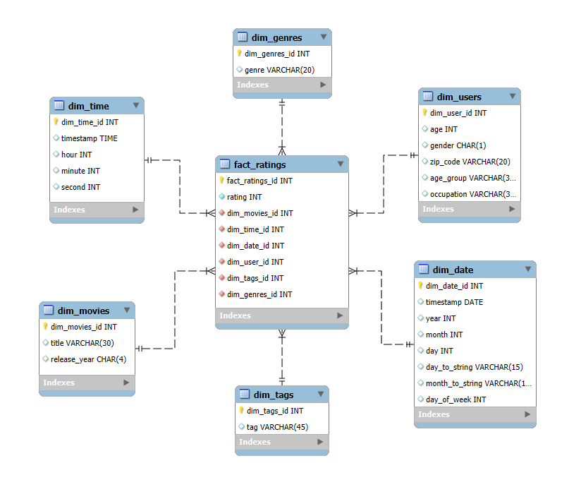

# **DT Projekt MovieLens Dataset**
Tento repozitár obsahuje implementáciu ETL procesu v Snowflake pre analýzu dát z MovieLens datasetu. Projekt sa zameriava na filmy, žánre filmov, pozícií, hodnotení a údaje o používateľoch. Výsledný dátový model umožňuje multidimenzionálnu analýzu a vizualizáciu dát.

---
## **1. Úvod a popis zdrojových dát**
Cieľom semestrálneho projektu je analyzovať dáta týkajúce sa kníh, používateľov a ich hodnotení. Táto analýza umožňuje identifikovať trendy v čitateľských preferenciách, najpopulárnejšie knihy a správanie používateľov.

Zdrojové dáta pochádzajú z Kaggle datasetu dostupného [tu](https://grouplens.org/datasets/movielens/). Dataset obsahuje osem hlavných tabuliek:
- `age_group`
- `genres`
- `genres_movies`
- `movies`
- `occupations`
- `ratings`
- `tags`
- `users`
  
Účelom ETL procesu bolo tieto dáta pripraviť, transformovať a sprístupniť pre viacdimenzionálnu analýzu.

---
### **1.1 Dátová architektúra**

### **ERD diagram**
Surové dáta sú usporiadané v relačnom modeli, ktorý je znázornený na **entitno-relačnom diagrame (ERD)**:

<p align="center">
  
  <br>
  <em>Obrázok 1 Entitno-relačná schéma AmazonBooks</em>
</p>

---
## **2. Dimenzionálny model**

Navrhnutý bol **hviezdicový model (star schema)**, pre efektívnu analýzu kde centrálny bod predstavuje faktová tabuľka **`fact_ratings`**, ktorá je prepojená s nasledujúcimi dimenziami:
- **`dim_movies`**: Obsahuje informácie o filmoch ako napríklad: id filmu, názov a rok vydania
- **`dim_genres`**: Obsahuje informácie o žánroch, čiže id žánru a názov
- **`dim_users`**: Obsahuje demografické údaje o používateľoch, ako sú vek, vekové kategórie, pohlavie, PSČ a povolanie.
- **`dim_tags`**: Obsahuje značky (tags), ktoré môžu slúžiť na analýzu nálad alebo na dodatočné triedenie filmov.
- **`dim_time`**: Obsahuje podrobné informácie o tag-och, ako napríklad: tagy, dátum a čas vytvorenia.
- **`dim_date`**: Obsahuje údaje o hodnotiacich dátumoch, ako sú deň, mesiac, rok, názvy mesiacov a dni v týždni.

Štruktúra hviezdicového modelu je znázornená na diagrame nižšie. Diagram ukazuje prepojenia medzi faktovou tabuľkou a dimenziami, čo zjednodušuje pochopenie a implementáciu modelu.

<p align="center">
  
  <br>
  <em>Obrázok 2 Schéma hviezdy pre MovieLens</em>
</p>

---
## **3. ETL proces v Snowflake**
ETL proces pozostával z troch kľúčových fáz: `extrakcie` (Extract), `transformácie` (Transform) a `načítania` (Load). Tento proces bol implementovaný v Snowflake na prípravu zdrojových dát zo staging vrstvy do viacdimenzionálneho modelu určeného na analýzu a vizualizáciu.

---
### **3.1 Extract (Extrahovanie dát)**
Dáta (formát `.csv`) najprv nahráme do Snowflake pomocou interného stage úložiska my_stage, odkiaľ sa následne importujú do staging tabuliek.

#### Kód pre vytvorenie stage-u:
```sql
CREATE OR REPLACE STAGE scorpion_stage;
```

#### Kód pre vytvorenie stage tabuľky:
```sql
CREATE OR REPLACE TABLE movies_staging (
    id INT PRIMARY KEY,
    title VARCHAR(255),
    release_year CHAR(4)
);
```

Do stage boli následne nahraté súbory obsahujúce údaje o movies, users, ratings, occupations, age_group, genres, genres_movies a tags. Dáta boli importované do staging tabuliek pomocou príkazu `COPY INTO`. Pre každú tabuľku sa použil podobný príkaz:

#### Kód pre nahratie a kopírovanie dát do stage tabuliek:
Pre každú tabuľku použijeme príkaz `COPY INTO`. Príklad pre tabuľku movies_staging:
```sql
COPY INTO movies_staging
FROM @scorpion_stage/movies.csv
FILE_FORMAT = (TYPE = 'CSV' FIELD_OPTIONALLY_ENCLOSED_BY = '"' SKIP_HEADER = 1);
```
Pri výskyte nekonzistentných záznamov bol použitý parameter `ON_ERROR = 'CONTINUE'`, ktorý zabezpečil, že proces pokračoval bez prerušenia napriek chybám.

---
### **3.2 Transform (Transformácia dát)**
V tejto etape sa vytvárajú dimenzie a faktová tabuľka. Dimenzie slúžia na poskytovanie kontextu, zatiaľ čo faktová tabuľka obsahuje hlavné metriky a údaje na analýzu.

### Vytvorenie jednotlivých dimenzií:

#### Dimenzia - `dim_tags`: obsahuje id určitého tag-u a názov tag-u.
```sql
CREATE OR REPLACE TABLE dim_tags AS
SELECT
    ROW_NUMBER() OVER (ORDER BY tags) AS ID,
    tags
FROM tags_staging
GROUP BY tags;
```

#### Dimenzia - `dim_time`: obsahuje id a údaje o hodinách, minútach a sekundách.
```sql
CREATE OR REPLACE TABLE dim_time AS
SELECT
    ROW_NUMBER() OVER (ORDER BY EXTRACT(HOUR FROM rated_at), EXTRACT(MINUTE FROM rated_at)) AS ID,
    EXTRACT(HOUR FROM rated_at) AS hour,
    EXTRACT(MINUTE FROM rated_at) AS minute,
    EXTRACT(SECOND FROM rated_at) AS second
FROM ratings_staging
GROUP BY EXTRACT(HOUR FROM rated_at), EXTRACT(MINUTE FROM rated_at), EXTRACT(SECOND FROM rated_at)
ORDER BY hour, minute, second;
```
#### Dimenzia - `dim_date`: obsahuje id, dátum, deň, deň v týždni (číslom aj slovne), mesiac, rok a štrvťrok.
```sql
CREATE OR REPLACE TABLE dim_date AS
SELECT
    ROW_NUMBER() OVER (ORDER BY CAST(rated_at AS DATE)) AS ID,
    CAST(rated_at AS DATE) AS date,
    EXTRACT(DAY FROM rated_at) AS day,
    MOD(EXTRACT(DOW FROM rated_at) + 1, 7) + 1 AS day_of_week,
    CASE MOD(EXTRACT(DOW FROM rated_at) + 1, 7) + 1
        WHEN 1 THEN 'Pondelok'
        WHEN 2 THEN 'Utorok'
        WHEN 3 THEN 'Streda'
        WHEN 4 THEN 'Štvrtok'
        WHEN 5 THEN 'Piatok'
        WHEN 6 THEN 'Sobota'
        WHEN 7 THEN 'Nedeľa'
    END AS day_of_week_as_string,
    EXTRACT(MONTH FROM rated_at) AS month,
    EXTRACT(YEAR FROM rated_at) AS year,
    EXTRACT(QUARTER FROM rated_at) AS quarter
FROM (
    SELECT DISTINCT
        CAST(rated_at AS DATE) AS rated_at,
        EXTRACT(DAY FROM rated_at) AS day,
        EXTRACT(DOW FROM rated_at) AS dow,
        EXTRACT(MONTH FROM rated_at) AS month,
        EXTRACT(YEAR FROM rated_at) AS year,
        EXTRACT(QUARTER FROM rated_at) AS quarter
    FROM ratings_staging
) unique_dates;
```
#### Dimenzia - `dim_movies` obsahuje id a názov filmu.
```sql
CREATE OR REPLACE TABLE dim_movies AS
SELECT
    ROW_NUMBER() OVER (ORDER BY title) AS ID,
    title
FROM movies_staging
GROUP BY title;
```
#### Dimenzia - `dim_genres` obsahuje id a názov žánru.
```sql
CREATE OR REPLACE TABLE dim_genres AS
SELECT
    ROW_NUMBER() OVER (ORDER BY name) AS ID,
    name
FROM genres_staging
GROUP BY name;
```
#### Dimenzia - `dim_users` obsahuje id, vekovú skupinu, pohlavie a pracovnú pozíciu.
```sql
CREATE OR REPLACE TABLE dim_users AS
SELECT
    u.id AS ID,
    CASE 
        WHEN u.age < 18 THEN 'Under 18'
        WHEN u.age BETWEEN 18 AND 24 THEN '18-24'
        WHEN u.age BETWEEN 25 AND 34 THEN '25-34'
        WHEN u.age BETWEEN 35 AND 44 THEN '35-44'
        WHEN u.age BETWEEN 45 AND 54 THEN '45-54'
        WHEN u.age >= 55 THEN '55+'
        ELSE 'Unknown'
    END AS age_group_name,
    u.gender,
    o.name AS occupations_name,
FROM USERS_STAGING u
JOIN occupations_staging o ON u.occupation_id = o.id;
```

#### Vytvorenie Fakt. Tabuľky `fact_ratings`. 
```sql
CREATE OR REPLACE TABLE fact_ratings AS
SELECT 
    r.id AS ID,
    r.rating,
    du.ID AS dim_users_ID,
    dt.ID AS dim_tags_ID,
    dm.ID AS dim_movies_ID,
    dg.ID AS dim_genres_ID,
    dtime.ID AS dim_time_ID,
    ddate.ID AS dim_date_ID
FROM ratings_staging r
JOIN dim_users du ON r.user_id = du.ID
JOIN dim_movies dm ON r.movie_id = dm.ID
LEFT JOIN tags_staging ts ON r.user_id = ts.user_id AND r.movie_id = ts.movie_id
LEFT JOIN dim_tags dt ON ts.tags = dt.tags
JOIN genres_movies_staging gm ON r.movie_id = gm.movie_id
JOIN dim_genres dg ON gm.genre_id = dg.ID
JOIN dim_time dtime 
    ON EXTRACT(HOUR FROM r.rated_at) = dtime.hour
   AND EXTRACT(MINUTE FROM r.rated_at) = dtime.minute
   AND EXTRACT(SECOND FROM r.rated_at) = dtime.second
JOIN dim_date ddate ON CAST(r.rated_at AS DATE) = ddate.date;
```

---
### **3.3 Load (Načítanie dát)**

Po úspešnom vytvorení `dimenzií` a `faktovej tabuľky` môžeme staging tabuľky odstrániť:

```sql
DROP TABLE IF EXISTS age_group_staging;
DROP TABLE IF EXISTS occupations_staging;
DROP TABLE IF EXISTS users_staging;
DROP TABLE IF EXISTS movies_staging;
DROP TABLE IF EXISTS genres_staging;
DROP TABLE IF EXISTS genres_movies_staging;
DROP TABLE IF EXISTS tags_staging;
DROP TABLE IF EXISTS ratings_staging;
```
ETL proces v Snowflake transformoval pôvodné údaje z `.csv` súborov do viacdimenzionálnej hviezdicovej štruktúry. Tento postup zahŕňal čistenie, obohatenie a reorganizáciu dát, čo umožnilo lepšiu analýzu preferencií a správania používateľov. Výsledný model slúži ako pevný základ pre tvorbu reportov a vizualizácií.

---
## **4. Vizualizácia dát**

Dashboard ponúka `päť vizualizácií`, ktoré poskytujú prehľad o hlavných metrikách a trendoch súvisiacich s filmami, žánrami, používateľmi a hodnoteniami. Tieto grafy odpovedajú na kľúčové otázky a pomáhajú detailnejšie analyzovať správanie používateľov a ich preferencie.

<p align="center">
  
  <br>
  <em>Obrázok 3 Päť diagramov/grafov MovieLens Datasetu</em>
</p>

---
### **Graf 1: Počet hodnotení podľa žánru (TOP 10)**
Vizualizácia ukazuje počet hodnotení pre jednotlivé žánre, pričom najviac hodnotení má `Comedy (352,625)` a najmenej `Children's (72,151)` z TOP 10. Graf odhaľuje preferencie používateľov podľa žánrov a pomáha identifikovať najpopulárnejšie kategórie filmov.

```sql
-- 1. SQL Dotaz pre počet hodnotení podľa žánru (TOP 10)
SELECT dg.name AS genre, COUNT(fr.id) AS rating_count
FROM fact_ratings AS fr
JOIN dim_genres AS dg ON fr.dim_genres_id = dg.id
GROUP BY dg.name
ORDER BY rating_count DESC
LIMIT 10;
```

---

**Autor:** Marián Šebora
